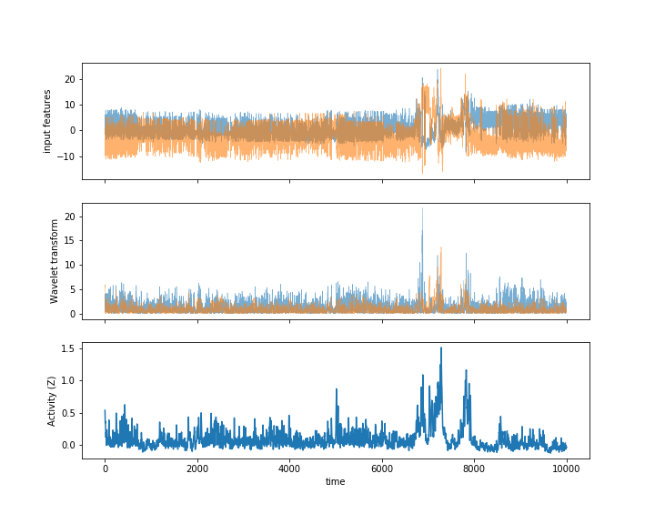

# activityLabeling

activityLabeling_* is a set of classes used to featurize time series data with wavelet transformations and infer latent state labels. The class is modeled after sklearn API and intended to provide one line fitting and latent state prediction after construction. The class is also pickleable to allow easy transfer of the prediction set between data sets. See demo.ipynb for example code

## System requirements

This project was tested and developed in python 3.7 environment managed by anaconda 2019.03 on a Ubuntu 18.04 operating system.

### Package dependencies

```
python 3.7
numpy 1.16.4
scipy 1.3.1
scikit-learn 0.21.2
pywavelets 1.0.3
ssm 0.0.1 (github.com/slinderman/ssm)
hmmlearn  (github.com/hmmlearn/hmmlearn)

matplotlib 3.1.1 (for visualization)

```

### Key Functions
**Constructor:**   Pass

**.fit_raw()** One line function to fit the apply wavelet convolution and latent state fitter to data

**.predict_raw()** One line function to apply wavelet and latent space transformations

### Demo

Output transformations of data series after fitting.



### Current implementations
**Latent Classifier**
* Linear dynamic system (LDS)
* Hidden Markov models (HMM)

**Wavelet Convolutions**
* haar
* debauchies-2 (db2)


## Authors

* **Samuel Bray**


## License

This project is licensed under GNUV3

## Basic Support

For questions, please contact sambray@stanford.edu
